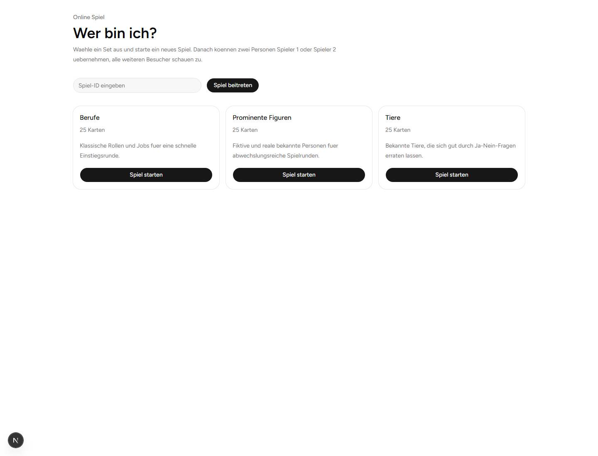
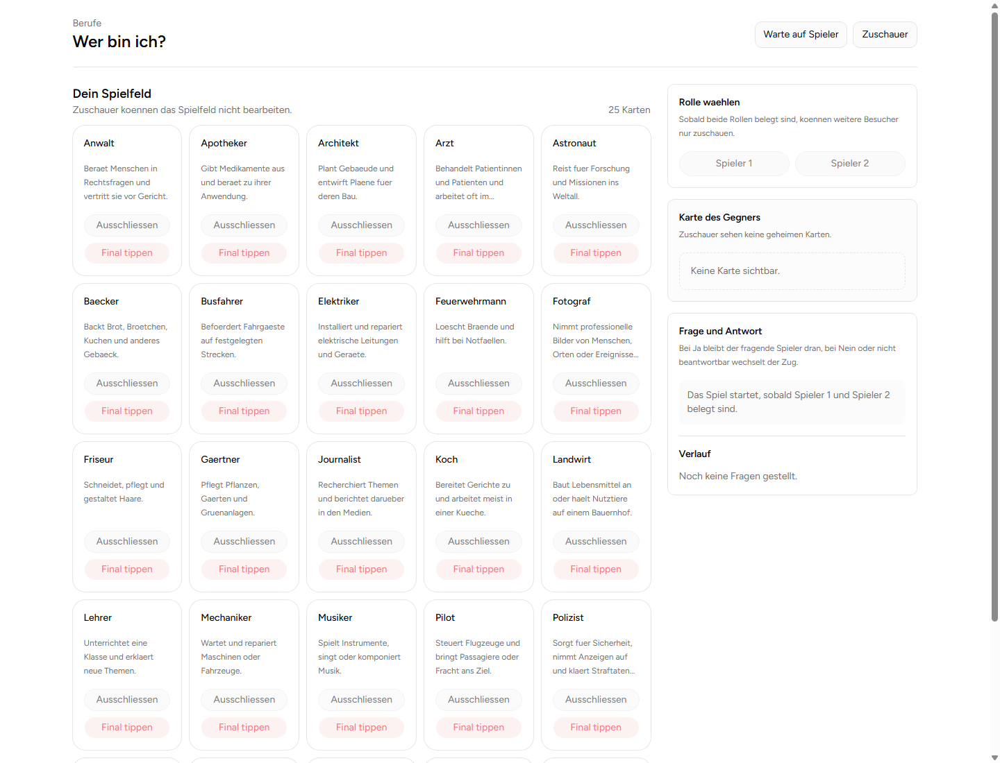

# Wer bin ich?

## Projektbeschreibung

Eine webbasierte Version des Ratespiels "Wer bin ich?" fuer zwei aktive Spieler und beliebig viele Zuschauer. Die App ist fuer schnelle Online-Spielrunden gedacht: Ein Spieler startet ein Spiel mit einem Kartenset, teilt die Spiel-ID, beide Spieler waehlen ihre Rolle und erraten danach die geheime Karte des Gegners ueber Ja-/Nein-Fragen.

## Features

- Spielstart ueber vorbereitete Kartensets
- Beitritt zu einem bestehenden Spiel per Spiel-ID
- Rollenwahl fuer Spieler 1 und Spieler 2
- Zuschauer-Modus ohne Bearbeitungsrechte
- Frage-/Antwort-Runden mit Zugwechsel
- Eigenes Ausschluss-Board pro Spieler
- Finaler Tipp mit Gewinner-/Verlierer-Auswertung
- Server Actions fuer Mutationen und Cache-Revalidierung

## Tech Stack

- Next.js 16 mit App Router
- React 19
- TypeScript
- Tailwind CSS 4
- Base UI / shadcn-inspirierte UI-Komponenten
- Prisma 7 mit generiertem Client
- Turso/libSQL als Datenbank
- Zod fuer Eingabevalidierung
- ESLint fuer statische Code-Pruefung

## Screenshots

### Startseite



### Spielansicht



## Setup

### Voraussetzungen

- Node.js 20 oder neuer
- npm
- Turso/libSQL-Datenbank mit gueltigen Zugangsdaten

### Installation

```bash
git clone <repository-url>
cd wer-bin-ich
npm install
```

### Umgebungsvariablen

Lege eine `.env`-Datei im Projektordner an:

```bash
TURSO_DATABASE_URL="libsql://..."
TURSO_AUTH_TOKEN="..."
DATABASE_URL="file:./dev.db"
```

`TURSO_DATABASE_URL` und `TURSO_AUTH_TOKEN` werden vom Prisma/libSQL-Adapter genutzt. `DATABASE_URL` ist fuer lokale Prisma-Konfigurationen vorhanden.

### Datenbank vorbereiten

```bash
npx prisma migrate deploy
npx prisma db seed
```

Der Seed legt drei Kartensets an: Berufe, Tiere und Prominente Figuren.

### Lokal starten

```bash
npm run dev
```

Die App laeuft danach unter:

```text
http://localhost:3000
```

### Checks

```bash
npm run lint
npm run build
```

## Nutzung

1. Auf der Startseite ein Set auswaehlen und ein neues Spiel starten.
2. Die Spiel-ID aus der URL teilen, z. B. `/game/11`.
3. Weitere Personen koennen die ID auf der Startseite eingeben und dem Spiel beitreten.
4. Spieler 1 und Spieler 2 waehlen jeweils ihre Rolle.
5. Sobald beide Rollen belegt sind, startet die Fragerunde.
6. Spieler markieren ausgeschlossene Karten auf ihrem eigenen Board und koennen am Ende final tippen.

## Architektur

```text
app/
+-- layout.tsx              # Root Layout, globale Fonts und Metadaten
+-- page.tsx                # Startseite mit Set-Auswahl und Join-per-ID
+-- globals.css             # Tailwind Theme und globale Styles
+-- game/
    +-- [gameId]/
        +-- page.tsx        # Dynamische Spielseite

components/
+-- ui/
    +-- button.tsx          # Wiederverwendbarer Button
    +-- card.tsx            # Card-Komponenten
    +-- dialog.tsx          # Dialog-Komponenten
    +-- input.tsx           # Eingabefeld
    +-- game/
        +-- SetSelection.tsx        # Set-Karten und Spielstart
        +-- GameShell.tsx           # Hauptlayout der Spielansicht
        +-- Board.tsx               # Kartenraster
        +-- BoardCard.tsx           # Einzelne Karte im Spielfeld
        +-- PlayerRoleSelector.tsx  # Rollenwahl
        +-- QuestionPanel.tsx       # Frage-/Antwortbereich
        +-- use-game-controller.ts  # Clientseitige Spielinteraktionen

lib/
+-- db.ts                   # Prisma Client mit libSQL Adapter
+-- utils.ts                # Kleine Hilfsfunktionen
+-- game/
    +-- actions.ts          # Zentrale Re-Exports der Server Actions
    +-- queries.ts          # Datenabfragen und DTO-Mapping
    +-- rules.ts            # Spielregeln und Statuslogik
    +-- schemas.ts          # Zod-Schemas fuer Validierung
    +-- types.ts            # Gemeinsame TypeScript-Typen
    +-- player-token.ts     # Token-Key fuer Spielerrollen
    +-- actions/
        +-- lifecycle.ts    # Spiel erstellen und beitreten
        +-- questions.ts    # Fragen stellen und beantworten
        +-- board.ts        # Karten ausschliessen und final tippen
        +-- shared.ts       # Action-Helfer und Cache-Revalidierung

prisma/
+-- schema.prisma           # Datenmodell: Set, Card, Game, Question, CardMark
+-- seed.ts                 # Seed-Daten fuer Kartensets
+-- migrations/             # Datenbankmigrationen

public/
+-- screenshots/            # README-Screenshots
```

## Datenmodell

- `Set`: Ein Kartenset, z. B. Berufe oder Tiere.
- `Card`: Eine einzelne Ratekarte innerhalb eines Sets.
- `Game`: Ein Spiel mit Status, aktuellem Zug, Rollen-Tokens und Zielkarten.
- `Question`: Eine gestellte Frage inklusive Antwortstatus.
- `CardMark`: Pro Spieler gespeicherte Markierung, ob eine Karte ausgeschlossen wurde.

## Rendering und Caching

- `/` wird statisch gerendert und per `revalidate = 3600` regelmaessig aktualisiert.
- `/game/[gameId]` ist mit `dynamic = "force-dynamic"` bewusst dynamisch, weil Cookies, Rollen und Spielstatus pro Request relevant sind.
- Server Actions rufen `revalidatePath` auf, damit geaenderte Spielzustaende sichtbar werden.
